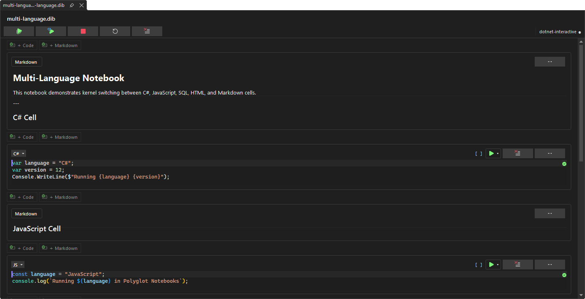
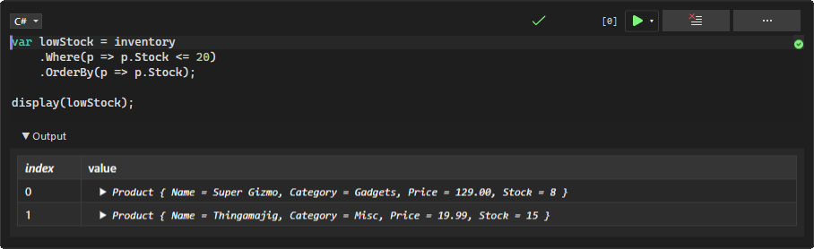

[marketplace]: <https://marketplace.visualstudio.com/items?itemName=MadsKristensen.PolyglotNotebooks>
[vsixgallery]: <https://www.vsixgallery.com/extension/PolyglotNotebooks.52d750bb-4c45-43d1-bc22-a9d5fe2cdf91>
[repo]: <https://github.com/madskristensen/PolyglotNotebooksVS>

# Polyglot Notebooks for Visual Studio

Download this extension from the [Visual Studio Marketplace][marketplace]
or get the latest CI build from [Open VSIX Gallery][vsixgallery].

--------------------------------------

Write and run C#, JavaScript, SQL, and more — right inside Visual Studio. Polyglot Notebooks brings an interactive notebook experience to the IDE you already know, powered by [.NET Interactive](https://github.com/dotnet/interactive). Mix languages in a single document, share variables across cells, and see rich output instantly.

📖 **[Read the full documentation](docs/index.md)** — getting started guide, feature walkthroughs, keyboard shortcuts, and troubleshooting.

## What You Get

**Multi-language cells** - Write C#, JavaScript, and SQL side by side in one notebook. Switch languages per cell with a dropdown or `#!` magic commands.

**Standard notebook formats** - Open and save `.dib` and `.ipynb` files. Share notebooks with VS Code users and Jupyter workflows without conversion.

**Rich output** - See HTML, images, tables, and formatted text rendered directly below each cell. No console window needed.

**IntelliSense everywhere** - Get completions, signature help, and diagnostics in every code cell — the same editing experience you expect from Visual Studio.

**Cross-language variable sharing** - Define a variable in C# and use it in JavaScript. The kernel handles the data transfer automatically.

**Variable Explorer** - Inspect all live variables across kernels in a dedicated tool window. See names, types, values, and which kernel owns each variable.

**Document Outline** - See the structure of your notebook at a glance in the standard Document Outline window. Markdown headings group related code cells into a navigable tree.

**Zero setup** - The extension detects and installs `dotnet-interactive` automatically when needed. Open a notebook file and start coding.

**Item template** - Create new `.dib` notebooks directly from the **Add New Item** dialog. No need to leave the IDE or copy files manually.

## Getting Started

### Create a New Notebook

Right-click a project or folder in Solution Explorer and select **Add > New Item**. Search for **Polyglot Notebook** in the template list. The template creates a `.dib` file with an empty C# code cell so you can start writing immediately.

### Open a Notebook

Double-click any `.dib` or `.ipynb` file in Solution Explorer, or use **File > Open > File** to open one from disk. The notebook editor opens with your cells ready to run.

### Write and Run Code

Type code in any cell and press **Shift+Enter** to execute. Output appears directly below the cell. Use the **▶** button or the run dropdown for more options like **Run Cells Above** and **Run Cell and Below**.

<!-- TODO: capture screenshot showing cell execution with output -->

### Switch Languages

Each cell has a language selector in its toolbar. Pick **C#**, **JavaScript**, **SQL**, or another available kernel. You can also type `#!csharp`, `#!javascript`, or `#!sql` on the first line to set the language.

### Inspect Variables

Open **View > Variable Explorer** to see every variable across all kernels. Click any row to see its full value in the detail pane. Hit **Refresh** after running cells to update.

### Navigate with Document Outline

Open **View > Other Windows > Document Outline** to see a tree view of your notebook. Markdown cells act as section headings with code cells nested beneath them. Click any item to jump straight to that cell.

### Manage the Notebook

The toolbar at the top of the editor gives you quick access to common actions:

- **Run All** - Execute every cell from top to bottom
- **Restart + Run All** - Restart the kernel and re-run everything
- **Interrupt** - Stop a long-running cell
- **Restart Kernel** - Reset kernel state without running cells
- **Clear All Outputs** - Remove all cell outputs at once

### Organize Cells

Use the cell menu (**···**) to insert, move, or delete cells. Drag-and-drop reordering keeps your notebook tidy.

## Keyboard Shortcuts

| Action               | Shortcut             |
| -------------------- | -------------------- |
| Run cell and advance | Shift+Enter          |
| Run all cells        | Ctrl+Shift+Enter     |
| Clear cell output    | Ctrl+Shift+Backspace |
| Interrupt execution  | Ctrl+.               |

## Example Notebooks

The [`examples/`](examples/) folder includes ready-to-run notebooks to get you started:

- **hello-world.dib** - Your first notebook — a quick C# "Hello, World!"
- **variable-sharing.dib** - Share data between C# and JavaScript cells
- **rich-output.dib** - Render HTML, tables, and images in cell output
- **multi-language.dib** - Mix C#, JavaScript, and SQL in one document
- **data-exploration.dib** - Query and visualize data interactively
- **basic-csharp.ipynb** - C# fundamentals in Jupyter notebook format
- **fsharp-notebook.ipynb** - F# cells in a `.ipynb` file

## How It Works

Polyglot Notebooks uses [dotnet-interactive](https://github.com/dotnet/interactive) as its execution engine. When you open a notebook, the extension starts a kernel process in the background. Each cell's code is sent to the appropriate language kernel, and results stream back as rich output.

If `dotnet-interactive` isn't installed, the extension offers to install it for you automatically — no terminal commands required.

## Contribute

For build instructions, architecture overview, and PR guidelines, see [CONTRIBUTING.md](CONTRIBUTING.md).

[Issues][repo], ideas, and pull requests are welcome.

## License

[Apache 2.0](LICENSE.txt)
