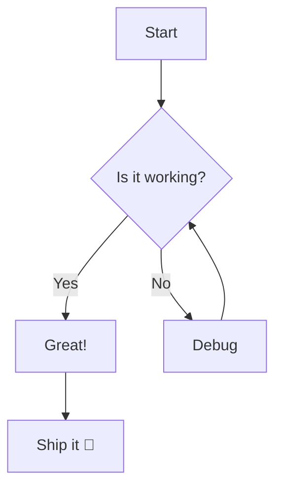

# Rich Output

Notebooks aren't just about running code — they're about *seeing* results. Polyglot Notebooks renders tables, HTML, images, Mermaid diagrams, and more directly below each cell. This guide shows you how to produce each type of output.

---

## The Key Insight: `display()` vs `Console.WriteLine()`

If you're coming from regular C# development, you're used to `Console.WriteLine()`. It still works in notebooks, but it always produces **plain text**. To unlock rich output, use `display()`:

```csharp
// Plain text — works, but boring
Console.WriteLine("Hello");

// Rich output — the formatter picks the best visual representation
display(new[] { new { Name = "Alice", Age = 30 }, new { Name = "Bob", Age = 25 } });
```

The second line renders a **formatted HTML table**, not a dump of object references. `display()` is the single most useful thing to learn in notebooks.

---

## Tables from Collections

Pass any collection to `display()` and it becomes a table:

```csharp
record Product(string Name, decimal Price, int Stock);

var products = new[]
{
    new Product("Widget", 9.99m, 120),
    new Product("Gadget", 49.95m, 30),
    new Product("Gizmo", 129.00m, 8),
};

display(products);
```

`dotnet-interactive` automatically formats the collection as an HTML table with headers matching the property names.

### From CSV

Output with `text/csv` MIME type is automatically parsed and rendered as an HTML table.

## HTML Output

For full control over what appears, render arbitrary HTML. Use `display()` with `.AsHtml()`:

```csharp
using Microsoft.DotNet.Interactive.Formatting;

var html = @"
<div style='padding: 1em; background: #f0fff4; border: 1px solid #38a169; border-radius: 6px;'>
  <h3 style='color: #276749;'>✅ Success</h3>
  <p>This HTML was rendered from a C# cell.</p>
</div>";

display(html.AsHtml());
```

HTML is rendered in a WebView2 control that matches your Visual Studio theme automatically (dark or light).

> **Note:** If the WebView2 runtime is not installed, a fallback message appears with a download link. Most Windows 10/11 installations include it already.

## JSON Output

JSON strings are detected and rendered with syntax highlighting and proper indentation:

```csharp
using System.Text.Json;

var data = new
{
    name = "Polyglot Notebooks",
    version = "1.0",
    features = new[] { "C#", "JavaScript", "SQL" },
    active = true
};

Console.WriteLine(JsonSerializer.Serialize(data, new JsonSerializerOptions { WriteIndented = true }));
```

## Images

### SVG

Display inline SVG graphics:

```csharp
using Microsoft.DotNet.Interactive.Formatting;

var svg = @"
<svg xmlns='http://www.w3.org/2000/svg' width='200' height='100'>
  <rect width='200' height='100' fill='#e2e8f0' rx='8'/>
  <circle cx='50' cy='50' r='30' fill='#4299e1'/>
  <text x='100' y='60' text-anchor='middle' font-size='14' fill='#2d3748'>SVG Output</text>
</svg>";

display(svg.AsHtml());
```

### Raster Images (PNG, JPEG, GIF)

Binary image output is rendered inline. Images wider than the configured maximum (default: 800px) are automatically scaled down. You can change this limit in [Settings](settings.md).

## Mermaid Diagrams

Create flowcharts, sequence diagrams, class diagrams, and more using [Mermaid](https://mermaid.js.org/) syntax. Use the `#!mermaid` kernel:



### Supported Diagram Types

Mermaid supports many diagram types:

- `graph` / `flowchart` — flow charts
- `sequenceDiagram` — sequence diagrams
- `classDiagram` — class diagrams
- `stateDiagram` — state diagrams
- `erDiagram` — entity-relationship diagrams
- `gantt` — Gantt charts
- `pie` — pie charts
- `gitgraph` — Git branch graphs
- `journey` — user journey maps
- `mindmap` — mind maps
- `timeline` — timeline diagrams

### Mermaid Theme Integration

Mermaid diagrams automatically adapt to your Visual Studio color theme. Dark themes get dark diagram backgrounds; light themes get light ones.

If a diagram has a syntax error, the raw source is displayed alongside an error message so you can fix it.

> **Tip:** You can enable or disable Mermaid rendering in [Settings](settings.md). When disabled, Mermaid content appears as plain text.

## Error Output

When a cell throws an unhandled exception, the error is displayed with:

- The exception type and message
- A stack trace (when available)
- Red-tinted styling to distinguish it from normal output

Example:

```csharp
// This will display an error
int zero = 0;
int result = 42 / zero;
```

The `DivideByZeroException` and its message are rendered clearly below the cell.

## Output Expand/Collapse

Large outputs include an expand/collapse toggle. Click it to show or hide the full content. This keeps long outputs from dominating the notebook view.

## Output Scrolling

Output areas have a maximum height. When content exceeds it, a scrollbar appears inside the output panel. Scroll-wheel behavior is smart:

- When the output content can scroll, the wheel scrolls within the output
- When you reach the top or bottom of the output, the wheel scrolls the notebook instead

## Tips

- **Use `display()` for rich output.** `Console.WriteLine()` always produces plain text. `display()` lets the formatter choose the best representation.
- **Collections become tables automatically.** Pass any `IEnumerable<T>` to `display()` for a nicely formatted table.
- **Combine HTML and C#.** Generate HTML strings dynamically in C# for custom visualizations.
- **Mermaid is great for documentation.** Embed architecture diagrams, workflows, and data models right alongside your code.

---

## Reference: Supported MIME Types

| MIME Type | Renders As | How to Produce |
|-----------|-----------|----------------|
| `text/plain` | Monospaced text | `Console.WriteLine(...)` |
| `text/html` | Rendered HTML | `display(html.AsHtml())` |
| `text/markdown` | Rendered Markdown | Markdown MIME output |
| `text/csv` | HTML table | CSV-formatted text output |
| `application/json` | Formatted JSON | `Console.WriteLine(json)` |
| `image/png` | Inline image | Binary image output |
| `image/jpeg` | Inline image | Binary image output |
| `image/gif` | Inline image | Binary image output |
| `image/svg+xml` | Inline SVG | SVG text output |
| `text/vnd.mermaid` | Mermaid diagram | `#!mermaid` cell |

## Next Steps

- [Variable Sharing](variable-sharing.md) — pass data between languages
- [Working with Cells](working-with-cells.md) — organize your notebook
- [Settings](settings.md) — configure output limits and rendering options

← [Back to Documentation Index](index.md)
